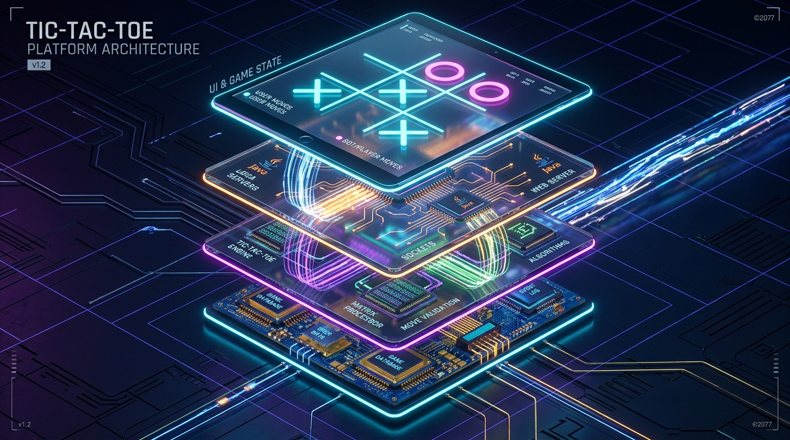
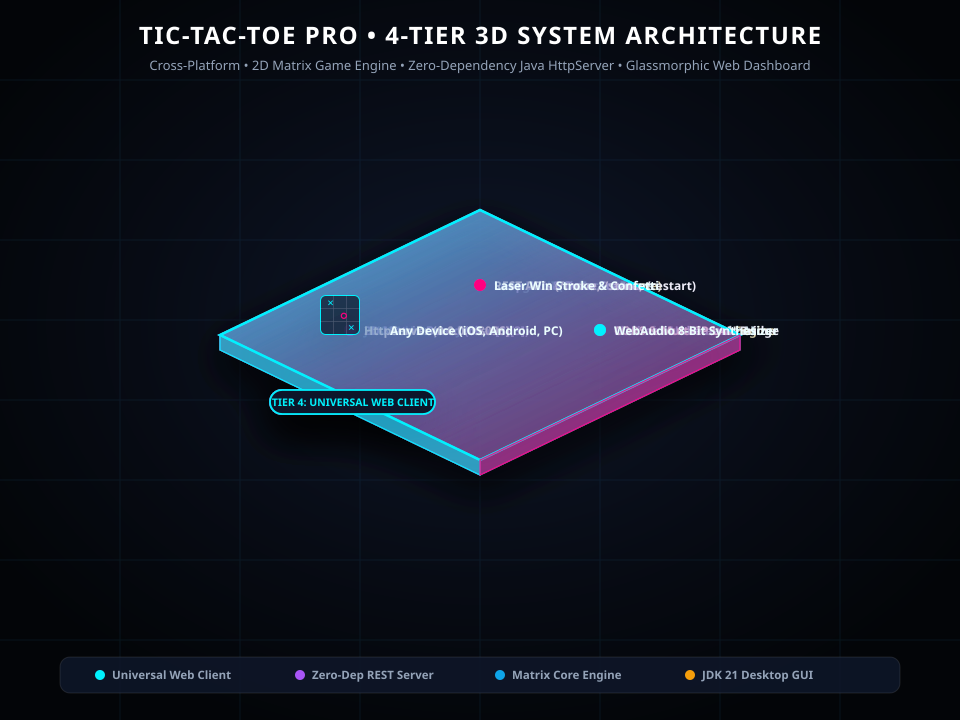

# ✕○ Tic-Tac-Toe Pro • Universal Two-Player & Tournament Platform

A full-stack, cross-platform **Tic-Tac-Toe Game Engine** developed with **Java 21** and a responsive modern web application designed to run **anywhere, anytime, in any browser, on any device** (desktop, laptop, tablet, iPhone, Android).

---

## 🎯 Core Requirements & Technical Skills Demonstrated

- **2D Arrays & Matrices (`char[3][3]`)**: Models the 3x3 game board matrix, cell state evaluation, and winning line coordinate tracking.
- **Loops (`for` & `while`)**: Iterates through rows, columns, and diagonal vectors to evaluate win conditions, full board draws, and AI decision branching.
- **Conditional Statements (`if`, `else if`, `switch`)**: Validates player moves, handles turn transitions, validates boundary constraints, and assesses game states (`IN_PROGRESS`, `X_WON`, `O_WON`, `DRAW`).
- **Multi-Round Tournament Play**: Supports consecutive rounds, alternating starting players, scorecards (Player X wins, Player O wins, Draws), and match resets.

---

## 🏗️ 4-Tier 3D Animated System Architecture



<p align="center">
  <em>Figure 1: High-Performance 3D Isometric System Architecture Stack</em>
</p>

### 📐 Interactive 3D Vector Isometric Schema


### 🧩 Architectural Layer Breakdown:
1. **Tier 4: Universal Web & Cross-Device Client**
   - **Cross-Platform Compatibility**: Fully responsive viewport styling supporting iPhone (iOS Safari), Android (Chrome), iPad/tablets, and desktop monitors.
   - **Procedural WebAudio Synthesis**: Real-time 8-bit arcade move swooshes, victory fanfare, and draw buzzers generated via HTML5 Web Audio API.
   - **Dynamic SVG Laser Streak & Confetti**: Animated SVG stroke connecting winning matrix cells paired with HTML5 canvas particle physics.
   - **Instant Mobile QR & LAN Discovery**: Built-in procedural QR code generator enabling instant mobile phone camera pairing over Wi-Fi/Hotspot.
   - **Offline Standalone Hybrid Engine**: Embedded client-side fallback matrix engine ensuring the game works even if opened as a standalone static HTML file.

2. **Tier 3: Embedded REST API & Network Server**
   - **Zero-Dependency HTTP Server**: Built on Java's native `com.sun.net.httpserver.HttpServer` bound to `0.0.0.0:8096` across all network interfaces.
   - **High-Speed REST Router**: Exposes `/api/state`, `/api/move`, `/api/restart-round`, `/api/new-game`, `/api/mode`, `/api/players`, and `/api/network`.
   - **Universal CORS Header Pipeline**: Allows access from any browser origin, domain, or device on the network.
   - **Multi-Adapter IPv4 Introspection**: Automatically resolves all non-loopback network interfaces (Wi-Fi, Ethernet, Mobile Hotspot).

3. **Tier 2: Core Matrix Game & AI Engine**
   - **2D Board Matrix (`char[3][3]`)**: Models the 3x3 playfield, active cell coordinates, and move history.
   - **Loop-Based Vector Scanners**: Systematically traverses rows, columns, and diagonal lines for win condition detection.
   - **Conditional State Machine**: Validates move coordinates, cell availability, and state transitions (`IN_PROGRESS`, `X_WON`, `O_WON`, `DRAW`).
   - **Recursive Minimax AI Engine**: Explores full game decision trees for unbeatable single-player mode, alongside casual and tactical heuristics.

4. **Tier 1: Desktop Application & Tournament Persistence**
   - **Native Java Swing GUI (`TicTacToeFrame.java`)**: Native desktop window featuring 3x3 tactile button grids and live scorecards.
   - **FlatLaf Modern Dark Theme**: Sleek dark styling with custom fonts and accent borders.
   - **Tournament Multi-Round Tracking**: Preserves scores (Player X wins, Player O wins, Draws) across multi-round series with alternating starting players.
   - **Cross-Client Threaded Synchronizer**: Periodic 600ms polling synchronization reflecting moves made from remote web/mobile clients.

---

## 📁 Workspace File Hierarchy

```text
Tic_Tac_Toe/
├── 🖼️ architecture.svg             # 4-Tier 3D Animated Isometric System Architecture
├── 🖼️ architecture_3d.jpg          # 3D High-Tech System Architecture Render
├── 📄 index.html                   # Universal Web App (HTML5, CSS3, JS, Web Audio)
├── 📦 TicTacToe.jar                # Self-contained executable JAR
├── ⚙️ build.bat                    # JDK 21 compiler & packaging script
├── 🚀 run.bat                      # One-click game launcher
├── 📄 MANIFEST.MF                  # JAR Manifest with Main-Class entry
├── 📄 README.md                    # Project documentation & architecture specs
├── 📚 lib/
│   └── flatlaf.jar                 # Modern Swing dark look-and-feel library
├── 📦 bin/                         # Compiled Java bytecode (.class)
└── ☕ src/com/tictactoe/
    ├── Main.java                   # Main entry point (HTTP server + Swing GUI)
    ├── model/
    │   └── GameState.java          # 3x3 matrix state & JSON serialization
    ├── service/
    │   └── GameEngine.java         # Loops, conditionals, matrix logic & AI bot
    ├── web/
    │   └── TicTacToeWebServer.java # Embedded HTTP server (0.0.0.0:8096) with CORS
    └── ui/
        └── TicTacToeFrame.java     # Swing GUI with real-time scoreboards
```

---

## ✨ Features & Capabilities

1. **Dual Interface**:
   - **Modern Web Dashboard**: Ultra-clean neon glassmorphism UI served directly by the Java backend at `http://localhost:8096`.
   - **Desktop GUI**: Native Java Swing application styled with the FlatLaf dark theme.
2. **Multi-Device & Cross-Browser ("Anywhere, Anytime, Any Browser, Any Device")**:
   - Runs seamlessly on Chrome, Safari, Firefox, Edge, Brave, and mobile browsers.
   - Binds to `0.0.0.0:8096` on all local network adapters (Wi-Fi, Ethernet, Hotspot).
   - Built-in **Mobile Connect Modal & QR Code** to scan and join from any phone or tablet on the same Wi-Fi.
   - **Offline Standalone Hybrid Engine**: Includes a mirrored client matrix engine in `index.html` so the app can run even if loaded statically without an active Java backend.
3. **Audio-Visual Feedback**:
   - **Procedural Synthesizer Audio**: Uses the HTML5 Web Audio API to synthesize retro 8-bit game moves, victory chords, and draw buzzers (zero audio file downloads needed).
   - **SVG Winning Streak Line**: Dynamic animated neon laser connecting the 3 winning cells.
   - **Confetti Physics**: Real-time canvas particle explosion celebrating round victories.
4. **Game Modes**:
   - **2-Player Local (Pass & Play)**: Custom player names, turn badges, and scorecard counters.
   - **vs AI Casual (Easy)**: Random selection among empty matrix cells.
   - **vs AI Tactical (Medium)**: Immediate win detection and player blocking.
   - **vs AI Master (Unbeatable)**: Complete recursive Minimax decision tree.

---

## 📡 REST API Reference

The Java backend exposes REST endpoints with full CORS headers:

| Endpoint | Method | Description |
|---|---|---|
| `GET /api/state` | `GET` | Returns current matrix, active player, scores, status, and move logs. |
| `POST /api/move` | `POST` | Makes a move at `?row=r&col=c` or via JSON body `{"row":r,"col":c}`. |
| `POST /api/reset-round` | `POST` | Resets the 3x3 board matrix for the next round while preserving scores. |
| `POST /api/new-game` | `POST` | Resets all scores, round counter, and the matrix board. |
| `POST /api/mode` | `POST` | Sets game mode (`PVP`, `AI_EASY`, `AI_MEDIUM`, `AI_HARD`). |
| `POST /api/players` | `POST` | Sets player names (`nameX`, `nameO`). |
| `GET /api/network` | `GET` | Returns local IP addresses and mobile URLs for network play. |

---

## 🚀 How to Build and Run

### Prerequisites
- Java Development Kit (JDK 21 or higher)

### 1. One-Click Launch (Precompiled JAR)
Double-click `run.bat` or run in terminal:
```cmd
cd c:\Cognifyz_Projects\Tic_Tac_Toe
run.bat
```

### 2. Build and Package from Source
```cmd
cd c:\Cognifyz_Projects\Tic_Tac_Toe
build.bat
```
This compiles the Java classes into `bin/`, unbundles FlatLaf, creates the manifest, and generates `TicTacToe.jar`.

### 3. Access in Browser
- **Local Computer**: [http://localhost:8096](http://localhost:8096)
- **Phone / Tablet**: Open `http://<your-computer-ip>:8096` or scan the QR code within the app.
